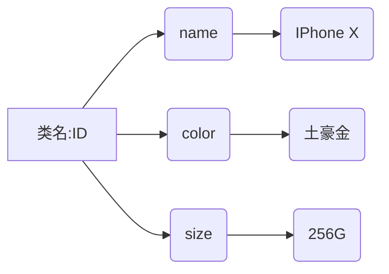

## String（字符串类型）

> 字符串类型是Redis最基本的数据类型，它能够存储任何形式的字符串，包括二进制数据。一个字符串类型键允许存储的数据最大容量为512MB。

```shell
# 字符串类型，笔记中基于 name -> hello; age -> 18 进行演示
# 准备工作：set name hello; set age 18;

# 给字符串追加内容 ,world!，返回(integer)12。返回追加后的字符串长度。如果键不存在，则自动创建key。
append name ",world"!

# 返回字符串的长度，返回(integer)12。返回字符串的长度。
strlen name

# 字符串截取，从字符串下标2开始截取，截取到下标5，包含开始和结尾。返回 llo,
# 第二个参数为-1，则截取到字符串最后。
getrange name 2 5

# 字符串替换，将字符串的下标替换为新的值，根据新的值长度自动替换原有长度
setrange name 6 "wanyun" # 返回 hello,wanyun

# incr(自增)，decr(自减)，返回自增或者自减后的内容。
incr age	# 返回(integer)19
decr age  # 返回(integer)18

# incrby(步长自增)，decrby(步长自减)，返回自增或者自减的内容。
incrby age 10 # 返回(integer)28
decrby age 10 # 返回(integer)18

# 同时获取/设置多个键值
MGET key [key ...]
MSET key value [key value ...]
```


## Hash（哈希类型）

#### 简介

> Hash类型，最多包含2^32-1个字段。值只能为String类型，不能是其他类型。哈希类型不能嵌套其他类型。
>
> 哈希适合存储对象：使用对象类别和ID构成键名，使用字段名表示对象的属性，而字段值则存储属性值。如手机对象转为hash，第一列为键名，第二列为属性名，第三列为属性值：



#### 操作

```shell
# HSET/HGET 设置、获取值
HSET key filed value [field value ...]			# 设置
HGET key filed [field ...]									# 取hash字段值
HGETALL key																	# 取hash所有字段和值

# HMSET/HMGET（注意：此命令，在Redis4.0移除）
HMSET key filed value [field value ...]			# 设置
HMGET key filed [field]											# 取hash字段值
HMGETALL key																# 取hash所有字段和值

# HEXISTS 判断字段存在
HEXISTS key field														# 判断字段是否存在

# HSETNX 字段不存在赋值
HSETNX key field value											# 字段不存在时赋值

# HINCRBY 自增数字
HINCRBY key field increment									# 增加整数

# HDEL 删除字段
HDEL key field [field ...]									# 删除一个或者多个字段

# HKEYS/HVALS 只获取字段名或者字段值
HKEYS key																		# 只获取字段名
HVALS key																		# 只获取字段值

# HLEN 获取字段数量
HLEN key
```

> 注意：`HSET`在修改数据时，不用事先判断字段是否存在来决定要执行的是插入还是更新。当执行的是插入时（即字段不存在），`HSET`命令会返回1，当执行的是更新操作时（即之前字段已存在），`HSET`命令会返回0。当键本身不存在时，HSET命令还会自动创建。


## List（列表类型）

#### 简介

> 列表类型`（List）`可以存储一个有序的字符串列表，常用的操作时向列表两端添加元素，或者获取列表的某个片段。列表类型内部使用**双向链表(double linked list)**实现的，所以向列表两端添加元素的时间复杂度为O(1)，获取的元素越接近两端，速度就越快。这意味着即使有几千万个元素列表，获取头部或尾部的记录也是极快的，不过使用链表的代价是通过索引访问元素比较慢。根据特性，可以完成如社交网站的新鲜事，我们关心的知识最新的内容，使用列表类型存储，即使是由几千万个，获取区中最新的100条数据也是极快的。同样列表也适合用来记录日志，可以保证新加入的日志速度不回受到已有日志数量影响。

#### 操作

```shell
# 向列表两端添加元素
LPUSH key element [element ...]
RPUSH key element [element ...]

# 从列表两端弹出元素
LPOP key element
RPOP key element

# 列表长度
LLEN key

# 获取片段（支持负索引，-1表示最右边的元素，-2表示最右边第二个元素，start大于stop返回空列表，stop越界则返回最后一个元素）
LRANGE key start stop

# 删除列表中指定的值
# LREM命令会删除列表中前count个值为element的元素，返回值是实际删除的元素个数。根据count的值不同，LREM执行方式略有差异
# 1) 当count > 0 时，LREM命令会从列表左边开始删除count个值为value的元素。
# 2) 当count < 0 时，LREM命令会从列表右边开始删除绝对值count个值为value的元素。
# 3) 当count = 0 时，LREM命令会删除所有值为element的元素。
LREM key count element

# 获取/设置指定索引的元素值
LINDEX key index
LSET key index element

# 只保留指定片段（删除除了指定索引范围的所有元素）
LTRIM key start end

# 向列表中插入元素（向key列表的pivot元素之前或者之后插入element元素）
LINSERT key BEFORE|AFTER pivot element

# 将元素从一个列表转移到另一个列表（先RPOP，再LPUSH。从source列表的右边弹出一个元素，然后将其加入destination列表的左边，并返回这个元素的值，整个过程是原子的。常用在队列中）
RPOPLPUSH source destination
```


## Set（集合类型）

#### 简介

> 一个集合类型（set）键可以存储至多 2^32 - 1个字符串。集合和列表有相似之处，下表列出对比。
>
> 集合类型的常用操作时向集合添加或者删除元素。集合类型在redis内部是使用(hash table)实现的，因此这些操作的时间复杂度都是O(1)。最方便的是多个集合之间可以进行并、交和差运算。

| 对比项   | 集合类型             | 列表类型             |
| -------- | -------------------- | -------------------- |
| 存储内容 | 至多2^32 - 1个字符串 | 至多2^32 - 1个字符串 |
| 有序性   | 否                   | 是                   |
| 唯一性   | 是                   | 否                   |


#### 操作

```shell
# 增加/删除元素
SADD key member [member ...]
SREM key member [member ...]

# 获取集合中所有元素
SMEMBERS key

# 判断元素是否在集合中
SISMEMBER key member

# 获取集合元素个数
SCARD key

# 随机获取集合元素
# count > 0 时，会随机从集合里获取count个不重复的元素，这些元素有可能相同。
# count < 0 时，会随机从集合里获取绝对值count个元素，这些元素有可能相同。
SRANDMEMBER key [count]

# 从集合中随机弹出一个元素
SPOP key

# 多个集合之间的差集 
SDIFF key [key ...]

# 多个集合的交集
SINTER key [key ...]

# 多个集合并集
SUNION key [key ...]
```


## Zset（有序集合）

#### 简介

> 在集合类型的基础上，有序集合类型为集合中每个元素都关联了一个分数，这使得我们不仅可以完成插入、删除和判断元素是否仔仔等集合类型所支持的所有操作，还能够完成获取分数最高（或最低）的前N个元素、获取指定分数范围内元素等与分数有关的操作。虽然集合中每个元素都是不同的，但是他们分数可以相同。
>
> 有序集合在某些方面和列表类型有些相似。
>
> 1. 二者都是有序的
> 2. 二者都可以获取某一范围内的元素。但是二者有很大区别，使得他们应用场景也是不同的。
> 3. 列表类型是通过链表实现的，获取靠近两端的数据时极快，而元素数量增多后，访问中间部分数据会较慢，所以它更适合“新鲜事”或者“日志”这样很少访问中间元素的应用。
> 4. 有序集合类型是使用哈希表和跳表（skip list）实现的，所以即使读取位于中间部分的数据速度也很快，时间复杂度是O(logN) 。
> 5. 在列表中不能简单的调整某个元素的位置，但是在有序集合中可以（通过更改这个元素的分数）。
> 6. 有序集合比列表更耗费内存。

#### 操作

```shell
# 增加/修改元素
ZADD key score member [score member ...]

# 获取元素的分数
ZSCORE key member

# 获取集合中元素数量
ZCARD key

# 获取指定分数范围内的元素个数
ZCOUNT key min max

# 删除一个或多个元素
ZREM key member [member ...]

# 按照排名范围删除元素
ZREMRANGEBYRANK key start stop

# 按照分数范围删除元素
ZREMRANGEBYSCORE key min max

# 获取元素排名
ZRANK key member		# 正序
ZREVRANK key member # 倒叙

# 获取排名在某个范围内的元素列表
ZRANGE key start stop [WITHSCORES] # ZRANGE会从小到大顺序返回start~stop内的所有元素，包含两端。
ZREVRANGE key start stop [WITHSCORES] # ZREVANGE会从大到小顺序返回start~stop内所有元素，包含两端。

# 获取分数范围内的元素列表
ZRANGEBYSCORE key min max [WITHSCORES] [LIMIT offset count]

# 增加某个元素分数(increment增加分数，increment可以是负数，减分)
ZINCRBY key increment member
```


## Stream（流类型）

#### 简介

> 流类型是Redis5.0退出的新数据类型。这个类型的退出是作为列表、有序列表以及“发布/订阅”模式的补充。流类型带有一些列表、有序列表和“发布/订阅”模式的特性。流类型可以理解成对日志格式的抽象。
>
> 1. 列表类型可以在头部和中间插入内容，而日志只能在末尾追加内容。流类型在插入一个新条目时，可以自动为其生成一个在流中的唯一ID（类似于日志的行号），这个ID可以用来进行查询操作。
> 2. 流类型每个条目都可以存在若干键值对，可以方便我们结构化存储日志详情。流类型还有一个重要用途是作为**消息中间件**使用。

#### 操作

```shell
# 唯一一个向流中添加条目的命令，XADD命令可以分为两部分：
# 第一部分用来向流中插入新条目；
# 第二部分（即MAXLEN所在指令组）用来要求流最多只保持指定数量的条目，其中第二部分是可选的。
# * 代表具体ID，Redis会根据时间戳，以毫秒为单位 + 后缀 "-"序号生成ID。在同一毫秒生成的时候，根据后缀 - 序号递增，例如：1616920548205-1。
# 插入的时候，如果新的ID比流中的ID小，则会报错。
XADD key [MAXLEN [=|≈] threshold * | ID field value [field value ...]]


# 根据ID来按范围查询条目
XRANGE key start end [COUNT count]

# 删除指定元素
XDEL key ID [ID ...]
 
# 裁剪流
XTRIM key MAXLEN [=|≈] threshold

# 获取流的长度
XLEN key

# 根据反向ID按范围查询条目
XREVRANGE key end start [COUNT count]
```

